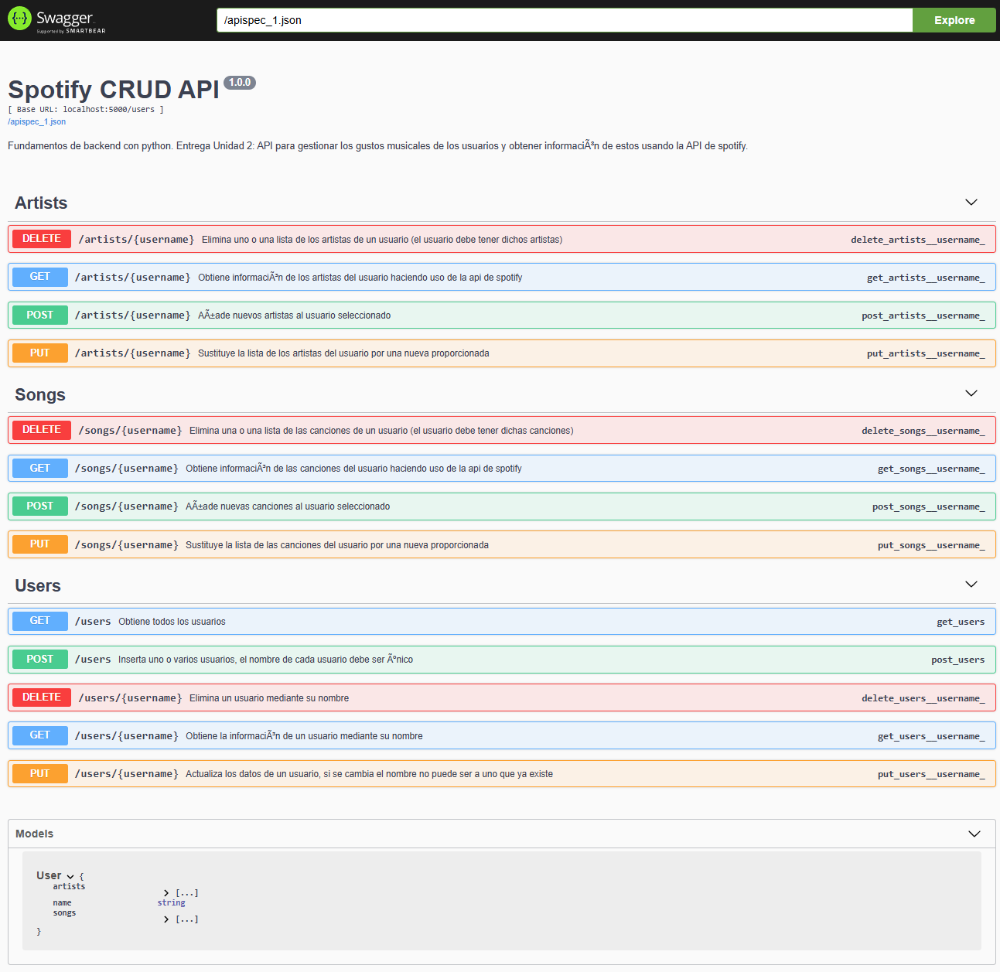
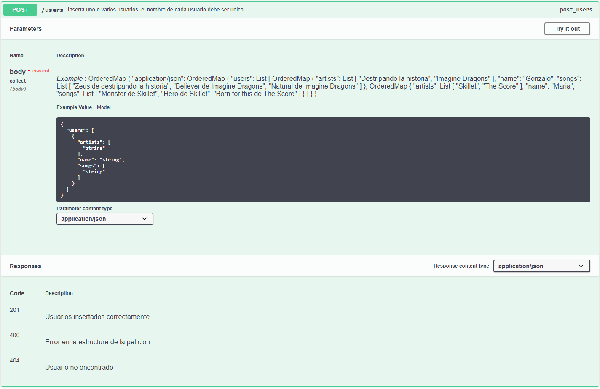

# CRUD con spotify
Universidad Europea\
Fundamendos de backend con python\
Ejercicio entregable de la Unidad 2\
Gonzalo Martínez Iáñez\

## Instalación
Crear el entorno virtual
```
py -m venv venv
```
Activar el entorno (Windows, para linux o mac usar su forma para ejecutar programas)
```
.\venv\Scripts\activate
```
Instalar la librerias necesarias
```
pip install Flask, requests, python-dotenv, pydantic, flasgger
```
Crear el fichero .env con las claves correspondientes para hacer peticiones a la API de Spotify.\
Para conseguir estas claves hay que registrarse en la [página web de desarrolladores de spotify](https://developer.spotify.com) y crear un proyecto que haga uso de API Web.
```
CLIENT_ID = 'clave_con_cliend_id'
CLIENT_SECRET = 'clave_con_secret_id'
```

## Ejecución
Lanzar la API y dejar ejecutando para poder recibir peticiones http (la ruta será http://127.0.0.1:5000)
```
py .\crud-spotify.py
```

## Memoria
### Funcionamiento
En esta aplicación se pueden crear usuarios que tienen un nombre único, una lista de canciones y una lista de artistas.\
A través de distintas peticiones http se puede leer, crear, modificar y eliminar los usuarios que hay en el sistema.\
Hay una serie de rutas para hacer estas peticiones, algunas afecta a todos los atributos del usuario y otros a una parte concreta de este.\

1. Users
    - GET /users : Devuelve todos los usuarios con sus canciones y artistas
    - GEt /users/"username" : Devuelve el nombre, canciones y artista del usuario con nombre username
    - POST /users : Añade un usuario o una lista de usuarios con nombre, canciones y artistas. Las canciones y artistas pueden estar vacios, pero debe estar el atributo en el json que se envía. Además no puede existir otro usuario con el mismo nombre.
    - PUT /users/"username" : Sustituye todos los atributos del usuario con nombre username.
    - DELETE /users/"username" : Elimina toda la información del usuario con nombre username.

2. Songs
    - GET /songs/"username" : Devuelve un listado con información sobre las canciones del usuario con nombre username.
    - POST /songs/"username" : Añade una o una lista de canciones al usuario con nombre username.
    - PUT /songs/"username" : Sustituye todas las canciones del usuario con nombre username por las nuevas proporcionadas.
    - DELETE /songs/"username" : Recibe una lista de canciones que eliminará del usuario con nombre username. Si el usuario no tiene esa canción no hará nada.

3. Artists
    - GET /artists/"username" : Devuelve un listado con información sobre los artistas del usuario con nombre username.
    - POST /artists/"username" : Añade una o una lista de artistas al usuario con nombre username.
    - PUT /artists/"username" : Sustituye todos los artistas del usuario con nombre username por las nuevas proporcionadas.
    - DELETE /artists/"username" : Recibe una lista de artistas que eliminará del usuario con nombre username. Si el usuario no tiene ese artista no hará nada.

4. Documentación
    - GET /apidocs : Devuelve una interfaz gráfica para el navegador que sirve para probar los disintos métodos.\


Si se pulsa sobre uno de los métodos se despliega un menú para ver que parámetros necesita cada método y las posibles respuesta que puede dar la petición.\
Los métodos que acceptan un body en formato JSON, hay un objeto de ejemplo en texto plano. Si se quiere usar en la petición hay que pulsar en el botón "Try it out" y copiar uno a uno los distintos atributos.\


### API de spotify
Esta API tiene dos funciones que hacen uso de la API de spotify. La primera sirve para buscar el id que tienen las canciones o los artistas ya que en la base de datos solo se almacena el nombre. La segunda, una vez consultado el id, se vuelve a realizar otra petición donde se solicitan los datos que he considerado más relevantes sobre los artistas o las canciones.\
1. Para los artistas:
    - id
    - nombre
    - seguidores
    - popularidad
    - url a su página de spotify
2. Para las canciones:
    - id
    - nombre
    - duración en milisegundos
    - popularidad
    - url a su página de spotify
    - artistas:
        - id
        - nombre
        - fecha de lanzamiento
        - tipo de album
        - cuantas canciones tiene el album
        - url a su página de spotify

Para hacer uso de esta API hay que solicitar un token que solo tiene una vida de una hora. Por tanto hay que comprobar que el token es válido, de lo contrario se obtiene uno nuevo y se repite la primera petición.\
Para un mejor funcionamiento, al escribir el nombre de una canción se puede añadir información extra ya que se obtiene el primer resultado de la consulta a spotify y puede haber dos canciones con el mismo nombre.\


### Conclusión
He usado Flask en lugar de FastAPI por ningún motivo en particular ya que es la primera vez que uso estas herramientas. Además por lo que hemos visto en clase se puede conseguir lo mismo con ambas por lo cual es indiferente cual se use.\
El modelo que he usado para guardar la información ha sido una única tabla de usuarios con los atributos: id (autogenerado), nombre (string único), lista de artistas (string que guarda en JSON una lista de artistas) y lista de canciones (guarda un JSON para las canciones). Mi decisión detrás de esto es que de esta forma se puede compactar toda la información relevante en una tabla de sql y no hace falta crear relaciones, lo que aumentaría la complejidad y la cantidad de código. Podría haber añadido más atributos sobre el usuario, pero no lo he visto necesario para realizar este proyecto ya que lo que entiendo que tiene más importancia en este ejercicio es saber crear una API crud en Flask y también hacer uso de la de spotify.\
Respecto a la decisión de usar la rutas estilo /users/"username" frente a /users?username=ejemplo, realmente no tiene ninguna ventaja. De las dos formas se habría conseguido un resultado idéntico.\
He usado una base de datos sqlite porque estoy familiarizado con la sintáxis SQL y es fácil de crear. Si el proyecto fuera más grande o fuera a tener más usuario, sería conveniente usar un servidor dedicado de tipo MYSQL o similar para que escale mejor. Pero para este proyecto concreto me ha parecido más acertado usar sqlite.\
Para crear la documentación automática con flasgger, he generado la estructura del fichero swagger.json con una inteligencia artificial genrativa ya que es un trabajo muy monótono, repetitivo y fácil de cometer un error.\